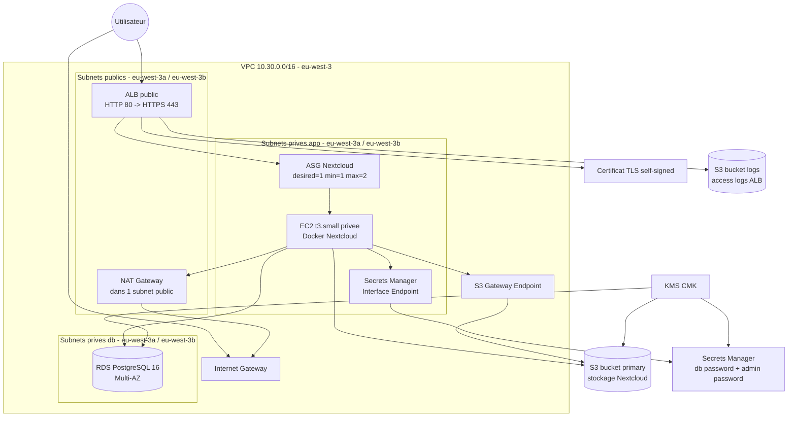

# Architecture Mermaid

```mermaid
flowchart TB
    user((Utilisateur))
    alb[ALB public<br/>HTTP 80 -> HTTPS 443]
    acm[Certificat TLS self-signed]
    asg[ASG Nextcloud<br/>desired=1 min=1 max=2]
    ec2[EC2 t3.small privee<br/>Docker Nextcloud]
    rds[(RDS PostgreSQL 16<br/>Multi-AZ)]
    s3primary[(S3 bucket primary<br/>stockage Nextcloud)]
    s3logs[(S3 bucket logs<br/>access logs ALB)]
    secrets[Secrets Manager<br/>db password + admin password]
    kms[KMS CMK]
    s3vpce[S3 Gateway Endpoint]
    smvpce[Secrets Manager<br/>Interface Endpoint]

    subgraph vpc[VPC 10.30.0.0/16 - eu-west-3]
        igw[Internet Gateway]

        subgraph public[Subnets publics - eu-west-3a / eu-west-3b]
            nat[NAT Gateway<br/>dans 1 subnet public]
            alb
        end

        subgraph app[Subnets prives app - eu-west-3a / eu-west-3b]
            asg
            ec2
            smvpce
        end

        subgraph db[Subnets prives db - eu-west-3a / eu-west-3b]
            rds
        end

        s3vpce
        nat
    end

    user --> alb
    user --> igw
    alb --> acm
    alb --> asg
    asg --> ec2
    ec2 --> rds
    ec2 --> s3primary
    ec2 --> smvpce
    smvpce --> secrets
    alb --> s3logs
    ec2 --> nat
    nat --> igw
    ec2 --> s3vpce
    s3vpce --> s3primary
    kms --> rds
    kms --> s3primary
    kms --> secrets
    
```