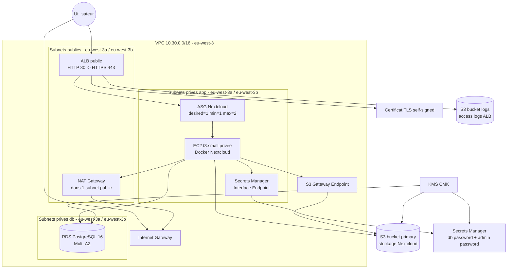
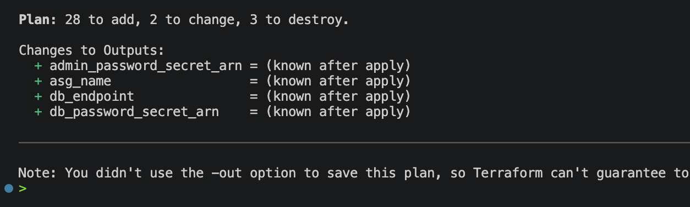
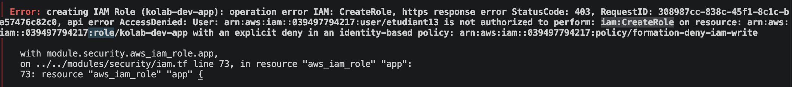

# RENDU — TP05 — Nextcloud sur AWS

> **Instructions de remplissage** : ce fichier est le `docs/RENDU.md` à livrer dans votre zip. Copiez-le tel quel dans votre repo à la racine de `docs/RENDU.md`, puis remplissez **toutes** les sections ci-dessous. Les `<!-- remplir ici -->` et les `TODO` doivent avoir disparu à la remise.

---

## 🟥 Rappel critique — avant de zipper

> 🟥 **Ne jamais committer** :
> - `*.tfvars` (sauf les `*.tfvars.example`)
> - `*.tfstate` et `*.tfstate.backup`
> - Le dossier `.terraform/`
> - Aucun mot de passe en clair (DB, admin Nextcloud, clé AWS, token GitHub)
> - Aucune clé privée (`*.pem`, `id_rsa`, etc.)
>
> 🔹 Vérifiez une dernière fois avant le zip :
> ```bash
> cd tp05-nextcloud
> grep -rE "(password|secret|AKIA)" --include="*.tf" --include="*.tfvars" . | grep -v example
> # Doit retourner 0 ligne
> ```

---

## Section 1 — Identification de l'équipe

**Numéro d'équipe** : `Groupe 3`
**Nom de code de l'équipe** *(optionnel)* : `TODO`
**Date de rendu** : `16/04/2026`

### Membres

| Prénom Nom | Rôle assigné | Email | Compte GitHub |
|------------|--------------|-------|---------------|
| Mylène RODRIGUES DOS SANTOS | Platform Lead (Rôle 1) | `m.rodrigues-dos-santos@ecole-ipssi.net` | `MyleneRDS` |
| Yassine BOUMRA | Network Engineer (Rôle 2) | | |
| Yann SALAÏ | Compute Engineer (Rôle 3) | | |
| Ayoub Bentoumia | Data Engineer (Rôle 4) |bentoumia.ayoub13@gmail.com | Ben-Ayoub|
| Clément DUCROCQ | Security Engineer (Rôle 5) | clement.d80150@gmail.com | ClementD |

> 🔷 Équipe à 4 personnes : indiquez qui a fusionné le rôle Security dans le rôle Platform.
>
> *Exemple : "Équipe à 4 — le Platform Lead a également porté le module `security`."*

---

## Section 2 — Résumé architecture

**En 5 lignes maximum**, décrivez l'infrastructure déployée (couches, AZ, interactions principales).

> *Exemple attendu :*
> *VPC 10.30.0.0/16 sur 2 AZ (eu-west-3a, eu-west-3b) avec 6 subnets (2 publics, 2 app, 2 db). ALB public HTTPS self-signed → ASG d'une EC2 t3.small privée qui exécute Nextcloud en container Docker. RDS PostgreSQL 16 Multi-AZ en subnet db. Stockage primaire S3 chiffré KMS, logs ALB sur second bucket S3. Secrets DB et admin dans Secrets Manager, lus par l'EC2 via IAM Instance Profile au boot.*

<!-- remplir ici -->

### Schéma Mermaid (à jour avec ce qui a été réellement déployé)



> 🔹 Astuce : copiez le schéma du fichier `ARCHITECTURE.md` que vous avez maintenu pendant la journée.

---

## Section 3 — Arbitrages techniques réalisés

Listez **au minimum 3 arbitrages** que vous avez faits pendant le TP (choix structurant, alternative considérée, raison du choix, conséquence).

### Arbitrage 1

Durée de vie du certificat TLS auto signé

- **Choix retenu** : 2 ans
- **Alternative envisagée** : 1 ans - 365j
- **Raison** : Un certficat 
- **Conséquence / limite** : `<!-- remplir -->`

> *Exemple :*
> - *Choix retenu : ASG à instance unique (`min=1 max=2 desired=1`).*
> - *Alternative envisagée : 2 instances actives derrière l'ALB.*
> - *Raison : Nextcloud sans Redis/cluster verrouille les fichiers au niveau disque — deux instances actives entraîneraient des erreurs de file locking sur le stockage S3 partagé.*
> - *Conséquence : pas de haute disponibilité applicative sur ce TP, mais l'ASG redémarre automatiquement l'instance en cas de crash.*

### Arbitrage 2 : Haute Disponibilité Base de Données

- Choix retenu : RDS PostgreSQL en mode Multi-AZ.
- Alternative envisagée : RDS Single Instance (Single-AZ).
- Raison : Conformité au cahier des charges "Production-grade". Le Multi-AZ permet une bascule automatique (failover) en cas de panne d'une zone de disponibilité, garantissant la continuité de service pour Nextcloud.
- Conséquence / limite : Coût de l'instance doublé car AWS provisionne une instance standby, mais nécessaire pour la résilience des données.

### Arbitrage 3

- Protection des Données vs Facilité de TP
- Choix retenu : deletion_protection = false et skip_final_snapshot = true
- **Raison** : Activer la protection contre la suppression et forcer un snapshot final (Recommandé en prod).Simplification de la gestion du cycle de vie des ressources durant le TP. 
Cela permet d'exécuter un terraform destroy complet sans blocage manuel ni accumulation de snapshots payants inutiles
- **Conséquence / limite** : Risque de suppression accidentelle de la base de données. En environnement de production réel, ces paramètres doivent impérativement être inversés.


### Arbitrages supplémentaires *(optionnels)*

- Arbitrage 4 (Si tu as besoin d'un autre) : Versioning S3
-	Choix retenu : Versioning activé sur le bucket Primary uniquement.
- Alternative envisagée : Activer le versioning partout.
- Raison : Le bucket Primary stocke les fichiers utilisateurs de Nextcloud (besoin de récupération en cas d'erreur). 
Le bucket Logs stocke des données temporaires qui sont automatiquement supprimées par une règle de Lifecycle après 90 jours.
- Conséquence / limite : Pas de récupération possible pour les logs supprimés, mais économie substantielle sur le coût du stockage S3.

---

## Section 4 — Retour sur les interfaces inter-modules

**Quelle interface a été la plus délicate à stabiliser ?**

L'interface security ↔ data pour la gestion des clés KMS. La difficulté résidait dans le fait que le module data a un besoin critique de l'ARN de la clé KMS pour chiffrer le RDS et le bucket S3 Primary. 
Tandis que le module security doit autoriser ces mêmes ressources dans sa Key Policy. 
Stabiliser l'ordre de passage de cette variable a été le point le plus complexe pour éviter les cycles de dépendance.

**Avez-vous dû modifier une interface en cours de route ? Si oui, laquelle et pourquoi ?**

> *Exemple : ajout de la variable `trusted_domain` en entrée du module compute, oubliée dans le contrat initial. PR #12 mergée après review du Platform Lead.*

<!-- remplir ici -->

**Qu'est-ce qui a le mieux fonctionné dans la collaboration inter-modules ?**

> *Exemple : le fait d'écrire les outputs en premier (avant les resources) a permis aux autres rôles de `plan` avec des valeurs fictives et avancer en parallèle.*

<!-- remplir ici -->

**Qu'est-ce qui a bloqué ?**

<!-- remplir ici -->

---

## Section 5 — Résultats `terraform plan` et `terraform apply`

Collez ici les **résumés** (pas les sorties complètes) des commandes finales exécutées depuis `envs/dev/`.

### `terraform plan` final

```
Plan: 28 to add, 2 to change, 3 to destroy.

Changes to Outputs:
  + admin_password_secret_arn = (known after apply)
  + asg_name                  = (known after apply)
  + db_endpoint               = (known after apply)
  + db_password_secret_arn    = (known after apply)
```

### `terraform apply` final

```
Apply complete! Resources: <!-- N --> added, <!-- N --> changed, <!-- N --> destroyed.

Outputs:

alb_dns_name  = "<!-- remplir -->"
nextcloud_url = "<!-- remplir -->"
db_endpoint   = "<!-- remplir -->"
# ... autres outputs
```

### Nombre total de ressources déployées

**Total** : `<!-- N -->` ressources

> 🔷 Ce nombre doit correspondre à ce qui est visible dans `02-apply-success.png`.

---

## Section 6 — Checklist des 5 screenshots obligatoires

Les captures doivent être dans `docs/screenshots/` au format PNG. Cochez chaque case quand le fichier est présent ET lisible.

- [X] `01-plan-dev.png` — sortie de `terraform plan` avec la ligne `Plan: N to add, ...` visible
  

- [ ] `02-apply-success.png` — sortie `Apply complete! Resources: N added.` + les outputs visibles
- [ ] `03-nextcloud-login.png` — page de login Nextcloud dans le navigateur avec l'URL ALB visible dans la barre d'adresse
- [ ] `04-file-in-s3.png` — console AWS S3 montrant un fichier uploadé depuis Nextcloud, avec le chiffrement KMS visible dans les propriétés
- [ ] `05-destroy-success.png` — sortie `Destroy complete! Resources: N destroyed.`

> 🟡 Piège courant : les screenshots avec informations sensibles visibles. Avant de les coller dans le zip, floutez les IP publiques personnelles, les tokens, les clés AWS complètes.
>
> 🔹 Astuce : si une capture contient un mot de passe admin Nextcloud en clair (généré puis affiché), régénérez-la avec le mot de passe masqué ou ne l'incluez pas.

---

## Section 7 — Coût estimé

Estimez le coût de l'infrastructure pour 24h de fonctionnement (dev). Utilisez Infracost si possible, sinon faites un calcul manuel à partir de la [page de tarification AWS eu-west-3](https://aws.amazon.com/ec2/pricing/on-demand/).

| Ressource | Quantité | Prix unitaire (USD) | Sous-total 24h (USD) |
|---|---|---|---|
| EC2 t3.small | 2 | $0.0263/h | $1.26 |
| ALB | 1 | $0.0252/h + $0.008/LCU-h (~1 LCU) | $0.80 |
| NAT Gateway | 2 | $0.048/h | $2.30 |
| RDS db.t3.micro Multi-AZ | 1 | $0.036/h | $0.86 |
| EBS RDS gp3 | 20 GB | $0.115/GB-mois | $0.08 |
| S3 primary + logs | ~1 GB | $0.023/GB-mois | ~$0.023 |
| KMS CMK | 1 | $1.00/mois | $0.03 |
| Secrets Manager | 2 | $0.40/secret/mois | $0.03 |
| VPC Endpoints (Interface) | 2 | $0.011/h/AZ | $0.53 |
| **Total 24h** | | | **~$5.89** |
| **Extrapolation 30 jours** | | | **~$176.70** |


**Méthode utilisée** : calcul manuel a partir des tarifs officiels AWS eu-west-3


**Commentaire** :

> *Exemple : le NAT Gateway seul représente ~35% du coût — on pourrait le supprimer après le boot initial de Nextcloud en `dev` puisque l'instance n'a plus besoin de sortir d'Internet.*

Hypotheses retenues :

- 1 seule EC2 `t3.small` car l'ASG est configure avec `desired_capacity = 1`
- 1 seul NAT Gateway car le module `networking` n'en cree qu'un
- 2 VPC Endpoint-hours factures pour Secrets Manager, car l'endpoint `Interface` est deploye sur 2 subnets/AZ
- 20 GB pour `S3 primary + logs` a titre d'hypothese de dev
- total calcule hors trafic variable : LCU ALB, data processing NAT Gateway, data processing VPC Endpoint, requetes S3/KMS/Secrets Manager

Le NAT Gateway, l'ALB et les VPC endpoints representent la plus grande part du cout fixe en environnement `dev`.

---

## Section 8 — Rétrospective équipe

### 🟢 3 choses qui ont bien marché

1. On a rempli tous les modules comme indiquer par les différents guides selon les roles.
2. On a créé une branche pour chaque roles et on a pu les merges au sein de la main.
3. Le `terraform plan` fonctionne dans envs/dev$


### 🔴 3 choses qui ont bloqué

1. On a eu du retard pour la mise en commun causé par des problèmes dans la gestion et l'utilisation de git
2. Des problèmes de cohérence dans les noms de varibales entre modules 
3. `terraform apply`échoue à cause de droit IAM manquant (iam:CreateRole)


### 🔷 3 améliorations pour la prochaine fois

1. Meilleur compréhensio de Git
2. Ajout des droits IAM pour la création de roles

---

## Section 9 — Contribution individuelle par rôle

**Chaque membre remplit son bloc lui-même.** Soyez honnêtes — cette section sert à l'individualisation de la note.

> 🔷 Le hash du commit est obtenu avec `git log --oneline -1 --author="Votre Nom"` ou `git log --format='%h %s' | head -5`.

---

### Rôle 1 — Platform Lead

**Membre** : `Mylène Rodrigues Dos Santos`

**Ce que j'ai livré** :
- `bootstrap/create-state-bucket.sh`
- `envs/dev/backend.tf, providers.tf, main.tf`
- `Revue d'une PR pour le merge d'une branche`
- `Complétion du RENDU.md`

---

### Rôle 2 — Network Engineer

**Membre** : `Yassine BOUMRA`

**Ce que j'ai livré** :
- `modules/networking/main.tf — VPC + 6 subnets + IGW + NAT`
- `route tables publiques et privées avec associations`
- `VPC endpoints Gateway S3 + Interface Secrets Manager`
- `outputs vpc_id, public_subnet_ids, private_app_subnet_ids, private_db_subnet_ids`
- `Complétion du RENDU.md`

---

### Rôle 3 — Compute Engineer

**Membre** : `Yann Salaï`

**Ce que j'ai livré** :
- `modules/compute/alb.tf`
- `modules/compute/asg.tf — launch template + ASG single`
- `templates/nextcloud-user-data.sh.tftpl — script Docker run Nextcloud`
- `outputs alb_dns_name, nextcloud_url, asg_name`
- `création et validation des PR`
- `Complétion du RENDU.md`

**Ce qui m'a surpris ou frustré** :

Comprendre les configurations qui pouvait bloquer le plan et apply une fois tout les modules mergés.

**Ce que j'ai appris** :

La mise en place de certificat TLS ainsi que l'utilisation des ASG avec les templates.

---

### Rôle 4 — Data Engineer

**Membre** : `Ayoub Bentoumia`

**Ce que j'ai livré** :
- `modules/data/rds.tf — RDS PG Multi-AZ, subnet group, parameter group`
- `modules/data/s3.tf — bucket primary + bucket logs avec SSE-KMS, block public, versioning, bucket policy ALB`
- `outputs db_endpoint, db_name, s3_primary_bucket_name, s3_logs_bucket_name`
- `README.md du module`

---

### Rôle 5 — Security Engineer

**Membre** : Clément DUCROCQ

**Ce que j'ai livré** :

- modules/security/sg.tf — 3 SG (alb, app, db) avec aws_vpc_security_group_ingress_rule v5
- modules/security/kms.tf — CMK + alias + rotation activée
- modules/security/iam.tf — IAM role EC2 + instance profile + policies scoped S3/Secrets
- modules/security/secrets.tf — 2 secrets (db_password, admin_password) générés via random_password

---

## Section 10 — Checklist finale avant remise

**L'équipe certifie collectivement que** :

- [ ] `terraform destroy` a été exécuté avec succès dans `envs/dev/` (screenshot `05-destroy-success.png` prouve `Destroy complete!`)
- [ ] La console AWS a été re-vérifiée : aucune EC2, RDS, NAT Gateway, ELB, EIP, Secret Manager, bucket S3 (hors bucket state) ne reste avec les tags de l'équipe
- [X] Aucun fichier `*.tfstate` ou `*.tfstate.backup` n'est présent dans le zip
- [X] Aucun dossier `.terraform/` n'est présent dans le zip
- [X] Aucun fichier `*.tfvars` personnel n'est présent (seul `terraform.tfvars.example` est autorisé)
- [X] Aucun secret en clair (mot de passe DB, admin, access key, token GitHub) n'est dans le code
- [ ] La commande `grep -rE "(password|secret|AKIA)" --include="*.tf" . | grep -v example` retourne 0 ligne
- [ ] Les 5 screenshots obligatoires sont dans `docs/screenshots/`
- [ ] Le fichier `docs/RENDU.md` (ce fichier) est rempli à 100 % — plus aucun `<!-- remplir -->` ni `TODO` résiduel
- [x] Le fichier `ARCHITECTURE.md` contient un schéma Mermaid à jour
- [X] Chaque module dans `modules/` a son `README.md` (minimum : titre + description + inputs/outputs)
- [X] Le fichier `.terraform.lock.hcl` est committé (mais pas `.terraform/`)
- [X] Les commits git sont tracés par auteur (pour la notation individuelle)
- [X] Le zip est nommé exactement `tp05-nextcloud-equipe<N>.zip`

### Commande de packaging recommandée

```bash
# Depuis la racine du projet
cd ~/formation-terraform/jour5

# Nettoyage des artefacts lourds avant zip
find tp05-nextcloud -type d -name ".terraform" -exec rm -rf {} +
find tp05-nextcloud -name "terraform.tfstate*" -delete

# Zip propre
zip -r tp05-nextcloud-equipe<N>.zip tp05-nextcloud/ \
  --exclude "*.terraform*" \
  --exclude "*.tfstate*"
```
