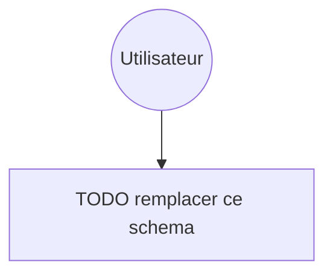

# RENDU — TP05 — Nextcloud sur AWS

> **Instructions de remplissage** : ce fichier est le `docs/RENDU.md` à livrer dans votre zip. Copiez-le tel quel dans votre repo à la racine de `docs/RENDU.md`, puis remplissez **toutes** les sections ci-dessous. Les `<!-- remplir ici -->` et les `TODO` doivent avoir disparu à la remise.

---

## 🟥 Rappel critique — avant de zipper

> 🟥 **Ne jamais committer** :
> - `*.tfvars` (sauf les `*.tfvars.example`)
> - `*.tfstate` et `*.tfstate.backup`
> - Le dossier `.terraform/`
> - Aucun mot de passe en clair (DB, admin Nextcloud, clé AWS, token GitHub)
> - Aucune clé privée (`*.pem`, `id_rsa`, etc.)
>
> 🔹 Vérifiez une dernière fois avant le zip :
> ```bash
> cd tp05-nextcloud
> grep -rE "(password|secret|AKIA)" --include="*.tf" --include="*.tfvars" . | grep -v example
> # Doit retourner 0 ligne
> ```

---

## Section 1 — Identification de l'équipe

**Numéro d'équipe** : `Groupe 3`
**Nom de code de l'équipe** *(optionnel)* : `TODO`
**Date de rendu** : `16/04/2026`

### Membres

| Prénom Nom | Rôle assigné | Email | Compte GitHub |
|------------|--------------|-------|---------------|
| Mylène RODRIGUES DOS SANTOS | Platform Lead (Rôle 1) | `m.rodrigues-dos-santos@ecole-ipssi.net` | `MyleneRDS` |
| Yassine BOUMRA | Network Engineer (Rôle 2) | | |
| Yann SALAÏ | Compute Engineer (Rôle 3) | | |
| Ayoub Bentoumia | Data Engineer (Rôle 4) |bentoumia.ayoub13@gmail.com | Ben-Ayoub|
| Clément DUCROCQ | Security Engineer (Rôle 5) | clement.d80150@gmail.com | ClementD |

> 🔷 Équipe à 4 personnes : indiquez qui a fusionné le rôle Security dans le rôle Platform.
>
> *Exemple : "Équipe à 4 — le Platform Lead a également porté le module `security`."*

---

## Section 2 — Résumé architecture

**En 5 lignes maximum**, décrivez l'infrastructure déployée (couches, AZ, interactions principales).

> *Exemple attendu :*
> *VPC 10.30.0.0/16 sur 2 AZ (eu-west-1a, eu-west-1b) avec 6 subnets (2 publics, 2 app, 2 db). ALB public HTTPS self-signed → ASG d'une EC2 t3.small privée qui exécute Nextcloud en container Docker. RDS PostgreSQL 16 Multi-AZ en subnet db. Stockage primaire S3 chiffré KMS, logs ALB sur second bucket S3. Secrets DB et admin dans Secrets Manager, lus par l'EC2 via IAM Instance Profile au boot.*

<!-- remplir ici -->

### Schéma Mermaid (à jour avec ce qui a été réellement déployé)



> 🔹 Astuce : copiez le schéma du fichier `ARCHITECTURE.md` que vous avez maintenu pendant la journée.

---

## Section 3 — Arbitrages techniques réalisés

Listez **au minimum 3 arbitrages** que vous avez faits pendant le TP (choix structurant, alternative considérée, raison du choix, conséquence).

### Arbitrage 1

Durée de vie du certificat TLS auto signé

- **Choix retenu** : 2 ans
- **Alternative envisagée** : 1 ans - 365j
- **Raison** : Un certficat 
- **Conséquence / limite** : `<!-- remplir -->`

> *Exemple :*
> - *Choix retenu : ASG à instance unique (`min=1 max=2 desired=1`).*
> - *Alternative envisagée : 2 instances actives derrière l'ALB.*
> - *Raison : Nextcloud sans Redis/cluster verrouille les fichiers au niveau disque — deux instances actives entraîneraient des erreurs de file locking sur le stockage S3 partagé.*
> - *Conséquence : pas de haute disponibilité applicative sur ce TP, mais l'ASG redémarre automatiquement l'instance en cas de crash.*

### Arbitrage 2 : Haute Disponibilité Base de Données

- Choix retenu : RDS PostgreSQL en mode Multi-AZ.
- Alternative envisagée : RDS Single Instance (Single-AZ).
- Raison : Conformité au cahier des charges "Production-grade". Le Multi-AZ permet une bascule automatique (failover) en cas de panne d'une zone de disponibilité, garantissant la continuité de service pour Nextcloud.
- Conséquence / limite : Coût de l'instance doublé car AWS provisionne une instance standby, mais nécessaire pour la résilience des données.

### Arbitrage 3

- Protection des Données vs Facilité de TP
- Choix retenu : deletion_protection = false et skip_final_snapshot = true
- **Raison** : Activer la protection contre la suppression et forcer un snapshot final (Recommandé en prod).Simplification de la gestion du cycle de vie des ressources durant le TP. 
Cela permet d'exécuter un terraform destroy complet sans blocage manuel ni accumulation de snapshots payants inutiles
- **Conséquence / limite** : Risque de suppression accidentelle de la base de données. En environnement de production réel, ces paramètres doivent impérativement être inversés.


### Arbitrages supplémentaires *(optionnels)*

- Arbitrage 4 (Si tu as besoin d'un autre) : Versioning S3
-	Choix retenu : Versioning activé sur le bucket Primary uniquement.
- Alternative envisagée : Activer le versioning partout.
- Raison : Le bucket Primary stocke les fichiers utilisateurs de Nextcloud (besoin de récupération en cas d'erreur). 
Le bucket Logs stocke des données temporaires qui sont automatiquement supprimées par une règle de Lifecycle après 90 jours.
- Conséquence / limite : Pas de récupération possible pour les logs supprimés, mais économie substantielle sur le coût du stockage S3.

---

## Section 4 — Retour sur les interfaces inter-modules

**Quelle interface a été la plus délicate à stabiliser ?**

L'interface security ↔ data pour la gestion des clés KMS. La difficulté résidait dans le fait que le module data a un besoin critique de l'ARN de la clé KMS pour chiffrer le RDS et le bucket S3 Primary. 
Tandis que le module security doit autoriser ces mêmes ressources dans sa Key Policy. 
Stabiliser l'ordre de passage de cette variable a été le point le plus complexe pour éviter les cycles de dépendance.

**Avez-vous dû modifier une interface en cours de route ? Si oui, laquelle et pourquoi ?**

> *Exemple : ajout de la variable `trusted_domain` en entrée du module compute, oubliée dans le contrat initial. PR #12 mergée après review du Platform Lead.*

<!-- remplir ici -->

**Qu'est-ce qui a le mieux fonctionné dans la collaboration inter-modules ?**

> *Exemple : le fait d'écrire les outputs en premier (avant les resources) a permis aux autres rôles de `plan` avec des valeurs fictives et avancer en parallèle.*

<!-- remplir ici -->

**Qu'est-ce qui a bloqué ?**

<!-- remplir ici -->

---

## Section 5 — Résultats `terraform plan` et `terraform apply`

Collez ici les **résumés** (pas les sorties complètes) des commandes finales exécutées depuis `envs/dev/`.

### `terraform plan` final

```
Terraform will perform the following actions:
  ...

Plan: <!-- N --> to add, <!-- N --> to change, <!-- N --> to destroy.
```

### `terraform apply` final

```
Apply complete! Resources: <!-- N --> added, <!-- N --> changed, <!-- N --> destroyed.

Outputs:

alb_dns_name  = "<!-- remplir -->"
nextcloud_url = "<!-- remplir -->"
db_endpoint   = "<!-- remplir -->"
# ... autres outputs
```

### Nombre total de ressources déployées

**Total** : `<!-- N -->` ressources

> 🔷 Ce nombre doit correspondre à ce qui est visible dans `02-apply-success.png`.

---

## Section 6 — Checklist des 5 screenshots obligatoires

Les captures doivent être dans `docs/screenshots/` au format PNG. Cochez chaque case quand le fichier est présent ET lisible.

- [ ] `01-plan-dev.png` — sortie de `terraform plan` avec la ligne `Plan: N to add, ...` visible
- [ ] `02-apply-success.png` — sortie `Apply complete! Resources: N added.` + les outputs visibles
- [ ] `03-nextcloud-login.png` — page de login Nextcloud dans le navigateur avec l'URL ALB visible dans la barre d'adresse
- [ ] `04-file-in-s3.png` — console AWS S3 montrant un fichier uploadé depuis Nextcloud, avec le chiffrement KMS visible dans les propriétés
- [ ] `05-destroy-success.png` — sortie `Destroy complete! Resources: N destroyed.`

> 🟡 Piège courant : les screenshots avec informations sensibles visibles. Avant de les coller dans le zip, floutez les IP publiques personnelles, les tokens, les clés AWS complètes.
>
> 🔹 Astuce : si une capture contient un mot de passe admin Nextcloud en clair (généré puis affiché), régénérez-la avec le mot de passe masqué ou ne l'incluez pas.

---

## Section 7 — Coût estimé

Estimez le coût de l'infrastructure pour 24h de fonctionnement (dev). Utilisez Infracost si possible, sinon faites un calcul manuel à partir de la [page de tarification AWS eu-west-1](https://aws.amazon.com/ec2/pricing/on-demand/).

| Ressource | Quantité | Prix unitaire (USD) | Sous-total 24h (USD) |
|---|---|---|---|
| EC2 t3.small | 2 | 14.31$/mois | `<!-- $ -->` |
| ALB | 1 | `<!-- $/h -->` | `<!-- $ -->` |
| NAT Gateway | 2 | `<!-- $/h -->` | `<!-- $ -->` |
| RDS db.t3.micro Multi-AZ | 1 | `<!-- $/h -->` | `<!-- $ -->` |
| EBS RDS gp3 | `<!-- GB -->` | `<!-- $/GB-mois -->` | `<!-- $ -->` |
| S3 primary + logs | `<!-- GB -->` | `<!-- $/GB-mois -->` | `<!-- $ -->` |
| KMS CMK | 1 | `1.00 / mois` | `<!-- $ -->` |
| Secrets Manager | 2 | `0.40 / secret / mois` | `<!-- $ -->` |
| VPC Endpoints | 2 | `<!-- $/h -->` | `<!-- $ -->` |
| **Total 24h** | | | `<!-- $ -->` |
| **Extrapolation 30 jours** | | | 281.40$/mois |

> *Exemple : Total 24h ~= 6.10 USD, extrapolation 30 jours ~= 183 USD.*

**Méthode utilisée** : calculator AWS


**Commentaire** :

> *Exemple : le NAT Gateway seul représente ~35% du coût — on pourrait le supprimer après le boot initial de Nextcloud en `dev` puisque l'instance n'a plus besoin de sortir d'Internet.*

Le VPC avec les 2 IPv4 - NAT - et Load-Balancer représentent 80% du coût

---

## Section 8 — Rétrospective équipe

### 🟢 3 choses qui ont bien marché

1. `<!-- remplir -->`
2. `<!-- remplir -->`
3. `<!-- remplir -->`

> *Exemple : "Le fait de figer les interfaces au kick-off nous a permis de travailler en parallèle sans se marcher dessus."*

### 🔴 3 choses qui ont bloqué

1. `<!-- remplir -->`
2. `<!-- remplir -->`
3. `<!-- remplir -->`

> *Exemple : "Cycle de dépendance entre security et data — perdu 45 min avant de comprendre qu'il fallait passer les ARN en variable plutôt que `depends_on`."*

### 🔷 3 améliorations pour la prochaine fois

1. `<!-- remplir -->`
2. `<!-- remplir -->`
3. `<!-- remplir -->`

> *Exemple : "Installer tfsec dans le pre-commit dès le matin aurait évité 3 HIGH détectés en fin de journée."*

---

## Section 9 — Contribution individuelle par rôle

**Chaque membre remplit son bloc lui-même.** Soyez honnêtes — cette section sert à l'individualisation de la note.

> 🔷 Le hash du commit est obtenu avec `git log --oneline -1 --author="Votre Nom"` ou `git log --format='%h %s' | head -5`.

---

### Rôle 1 — Platform Lead

**Membre** : `Mylène Rodrigues Dos Santos`

**Ce que j'ai livré** :
- `bootstrap/create-state-bucket.sh`
- `envs/dev/backend.tf, providers.tf, main.tf`
- `<!-- ex: revue de toutes les PRs avec au moins 1 approval -->`
- `<!-- ex: orchestration du terraform apply collectif à 14h30 -->`

**Ce qui m'a surpris ou frustré** :

> *Exemple : "J'ai sous-estimé le temps de bootstrap du bucket state — 15 min à cause d'une IAM policy S3 manquante pour KMS."*

<!-- remplir ici -->

**Ce que j'ai appris** :

> *Exemple : "La feature `use_lockfile` du backend S3 natif en 1.10 remplace complètement DynamoDB — plus simple et moins cher."*

<!-- remplir ici -->

**Hash du dernier commit significatif que j'ai fait** : `<!-- ex: a1b2c3d -->`

---

### Rôle 2 — Network Engineer

**Membre** : `<!-- Prénom Nom -->`

**Ce que j'ai livré** :
- `<!-- ex: modules/networking/main.tf — VPC + 6 subnets + IGW + NAT -->`
- `<!-- ex: route tables publiques et privées avec associations -->`
- `<!-- ex: VPC endpoints Gateway S3 + Interface Secrets Manager -->`
- `<!-- ex: outputs vpc_id, public_subnet_ids, private_app_subnet_ids, private_db_subnet_ids -->`
- `<!-- ex: README.md du module généré via terraform-docs -->`

**Ce qui m'a surpris ou frustré** :

> *Exemple : "La différence entre VPC endpoint Gateway (S3, DynamoDB, gratuit) et Interface (Secrets Manager, payant à l'heure) — j'ai failli mettre Interface pour S3."*

<!-- remplir ici -->

**Ce que j'ai appris** :

<!-- remplir ici -->

**Hash du dernier commit significatif que j'ai fait** : `<!-- ex: a1b2c3d -->`

---

### Rôle 3 — Compute Engineer

**Membre** : `<!-- Prénom Nom -->`

**Ce que j'ai livré** :
- `<!-- ex: modules/compute/alb.tf — ALB + TG + listener HTTPS self-signed -->`
- `<!-- ex: modules/compute/asg.tf — launch template + ASG single -->`
- `<!-- ex: templates/nextcloud-user-data.sh.tftpl — script Docker run Nextcloud -->`
- `<!-- ex: outputs alb_dns_name, nextcloud_url, asg_name -->`

**Ce qui m'a surpris ou frustré** :

> *Exemple : "Le user_data a mis 4 minutes à finir — il faut attendre l'install Docker + pull de l'image Nextcloud avant que le health check ALB passe."*

<!-- remplir ici -->

**Ce que j'ai appris** :

<!-- remplir ici -->

**Hash du dernier commit significatif que j'ai fait** : `<!-- ex: a1b2c3d -->`

---

### Rôle 4 — Data Engineer

**Membre** : `<!-- Ayoub Bentoumia -->`

**Ce que j'ai livré** :
- `<!-- ex: modules/data/rds.tf — RDS PG Multi-AZ, subnet group, parameter group -->`
- `<!-- ex: modules/data/s3.tf — bucket primary + bucket logs avec SSE-KMS, block public, versioning, bucket policy ALB -->`
- `<!-- ex: outputs db_endpoint, db_name, s3_primary_bucket_name, s3_logs_bucket_name -->`
- `<!-- ex: README.md du module -->`

**Ce qui m'a surpris ou frustré** :

> *Exemple : "La bucket policy pour laisser l'ALB écrire ses access logs — il faut utiliser le service principal correct et autoriser PutObject."*

<!-- remplir ici -->

**Ce que j'ai appris** :

<!-- remplir ici -->

**Hash du dernier commit significatif que j'ai fait** : `<!-- ex: a1b2c3d -->`

---

### Rôle 5 — Security Engineer

**Membre** : Clément DUCROCQ

**Ce que j'ai livré** :

- modules/security/sg.tf — 3 SG (alb, app, db) avec aws_vpc_security_group_ingress_rule v5
- modules/security/kms.tf — CMK + alias + rotation activée
- modules/security/iam.tf — IAM role EC2 + instance profile + policies scoped S3/Secrets
- modules/security/secrets.tf — 2 secrets (db_password, admin_password) générés via random_password

**Ce qui m'a surpris ou frustré** :

> *Exemple : "La policy IAM avec `Resource` scoped au bucket ARN exact + `${arn}/*` pour les objets — tfsec flag tous les `Resource = *`."*


**Ce que j'ai appris** :

J'ai appris à faire des réfrences entre plusieurs fichiers terraform pour sécuriser au mieux l'infra

**Hash du dernier commit significatif que j'ai fait** : 1b038ce
---

## Section 10 — Checklist finale avant remise

**L'équipe certifie collectivement que** :

- [ ] `terraform destroy` a été exécuté avec succès dans `envs/dev/` (screenshot `05-destroy-success.png` prouve `Destroy complete!`)
- [ ] La console AWS a été re-vérifiée : aucune EC2, RDS, NAT Gateway, ELB, EIP, Secret Manager, bucket S3 (hors bucket state) ne reste avec les tags de l'équipe
- [X] Aucun fichier `*.tfstate` ou `*.tfstate.backup` n'est présent dans le zip
- [X] Aucun dossier `.terraform/` n'est présent dans le zip
- [X] Aucun fichier `*.tfvars` personnel n'est présent (seul `terraform.tfvars.example` est autorisé)
- [X] Aucun secret en clair (mot de passe DB, admin, access key, token GitHub) n'est dans le code
- [ ] La commande `grep -rE "(password|secret|AKIA)" --include="*.tf" . | grep -v example` retourne 0 ligne
- [ ] Les 5 screenshots obligatoires sont dans `docs/screenshots/`
- [ ] Le fichier `docs/RENDU.md` (ce fichier) est rempli à 100 % — plus aucun `<!-- remplir -->` ni `TODO` résiduel
- [ ] Le fichier `ARCHITECTURE.md` contient un schéma Mermaid à jour
- [X] Chaque module dans `modules/` a son `README.md` (minimum : titre + description + inputs/outputs)
- [ ] Le fichier `.terraform.lock.hcl` est committé (mais pas `.terraform/`)
- [X] Les commits git sont tracés par auteur (pour la notation individuelle)
- [X] Le zip est nommé exactement `tp05-nextcloud-equipe<N>.zip`

### Commande de packaging recommandée

```bash
# Depuis la racine du projet
cd ~/formation-terraform/jour5

# Nettoyage des artefacts lourds avant zip
find tp05-nextcloud -type d -name ".terraform" -exec rm -rf {} +
find tp05-nextcloud -name "terraform.tfstate*" -delete

# Zip propre
zip -r tp05-nextcloud-equipe<N>.zip tp05-nextcloud/ \
  --exclude "*.terraform*" \
  --exclude "*.tfstate*"
```
